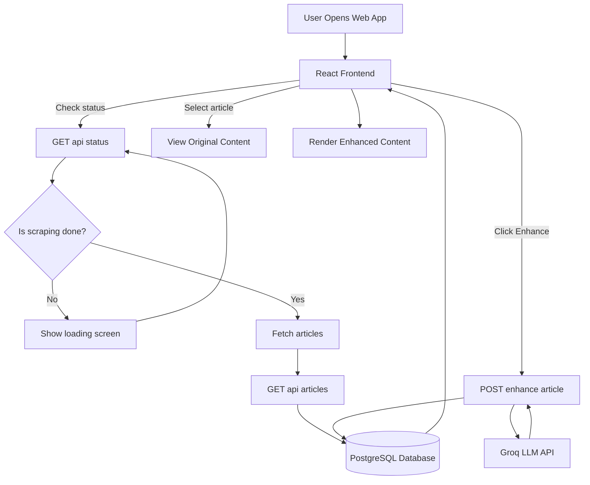

# BeyondChats AI Article Enhancer

This project scrapes blog articles from the BeyondChats website and enhances them using AI. Users can compare original content with AI-enhanced versions in a clean UI.

# System Architecture & Data Flow



## Project Structure

```
beyondchats-assignment/
│
├── backend/          # Express + AI + Database
├── frontend/         # React UI
└── README.md
```

## Features

- Scrapes articles from BeyondChats
- Stores data in PostgreSQL
- Enhances articles using AI
- Clean two-panel UI
- Markdown rendering
- One-click enhancement
- No duplicate articles

## Tech Stack

### Backend
- Node.js
- Express
- TypeScript
- PostgreSQL
- Drizzle ORM
- Groq AI (LLaMA 3.1)

### Frontend
- React
- TypeScript
- Tailwind CSS
- React Markdown

## How It Works

1. Backend scrapes blog articles
2. Data is cleaned and stored
3. Frontend fetches articles
4. User clicks "Enhance"
5. AI rewrites content
6. Enhanced version is displayed

## Running the Project

### Backend

```bash
cd backend
npm install
npm run dev
```

Runs on: http://localhost:5000

### Frontend

```bash
cd frontend
npm install
npm run dev
```

Runs on: http://localhost:5173

## Environment Variables

Create a `.env` file in the backend directory with the following:

```
DATABASE_URL=your_postgres_url
GROQ_API_KEY=your_groq_key
```

## AI Model Used

- **Model**: Groq LLaMA 3.1 (8B)
- Fast and reliable
- Free tier supported
- Good for content rewriting
